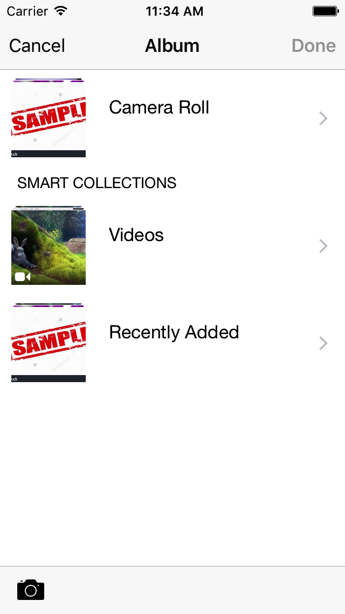
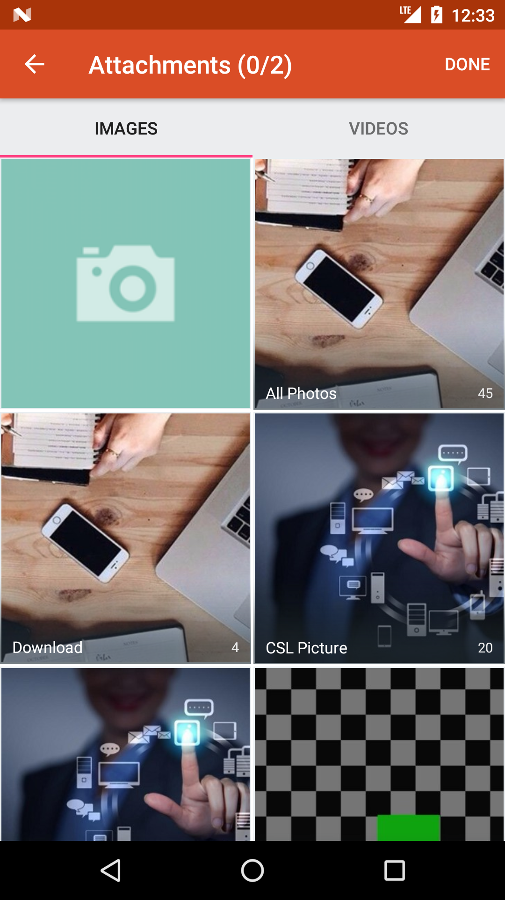

[](https://www.npmjs.com/package/nativescript-mediafilepicker)
[](https://www.npmjs.com/package/nativescript-mediafilepicker)

# nativescript-mediafilepicker
This plugin will allow user to pick video & image files from their device. User can also use their camera to take picture from this plugin directly. It's a combination features of [nativescript-imagepicker](https://github.com/NativeScript/nativescript-imagepicker) and [nativescript-camera](https://github.com/NativeScript/nativescript-camera/) plugin with some extended features using following libaries:

* Android: [Android-FilePicker](https://github.com/DroidNinja/Android-FilePicker)
* iOS: [GMImagePicker](https://github.com/codelathe/GMImagePicker.git)

**Note for iOS:** In iOS you can't use file's link directly from the picker because of the permission issue. For resolving this issue this plugin will copy the selected files in your app's document directory under a new folder `filepicker`. So, after using that file you can delete that file to reduce memory use. You can check the demo app.

**Note for User Linux:** Before adding this plugin, make sure your permissions are open, at 755 or 777. Run this command to change the permissions of all directories in your project :

```
sudo find my_dir/my_project -type d -exec chmod 755 {} \;
```
Or
```
sudo find my_dir/my_project -type d -exec chmod 777 {} \;
```

**Features:**

* Image and video file picker
* Multiple or single selection
* Camera support for taking picture
* File picker (Only for Android)
* Custom file type (Only for Android) 

## Installation

```javascript
tns plugin add nativescript-mediafilepicker
```

## Usage 
### In TS
```javascript
    import { Mediafilepicker, MediaFilepickerOptions } from 'nativescript-mediafilepicker';
    private mediafilepicker;
    
    let options: MediaFilepickerOptions = {
      android: {
        mxcount: 2,
        enableImagePicker: true,
        enableVideoPicker: true,
        enableCameraSupport: true,
      },
      ios: {
        allowsMultipleSelection: true,
        title: "Album",
        showCameraButton: true,
      }
    };
    this.mediafilepicker = new Mediafilepicker();

    this.mediafilepicker.on("getFiles", function (res: any) {
 
      let files = res.files;

      if (files.length > 0) {

        files = files.split(",");

        files.forEach(file => {

          let fileName = file.replace(/^.*[\/]/, '');

          console.log(file);
          console.log(fileName);

          // you can do anything here


          if (app.ios) {

            let folder = fs.knownFolders.documents();
            let file = folder.getFolder("filepicker").getFile(fileName);

            if (fs.File.exists(file.path)) {
              folder.getFile("filepicker/" + fileName).remove()
            } else {
              console.log("not found")
            }
          }
        });
      }else{
        console.log("There was some problem to select the file. Looks like user has cancel it.")
      }

    })
    this.mediafilepicker.on("error", function (res: any) {
        console.log(res.msg)
    })
    this.mediafilepicker.startFilePicker(options);
```

### In JS
```javascript
const fs = require('file-system');
const MF = require("nativescript-mediafilepicker");
var mediafilepicker = new MF.Mediafilepicker();

let MediaFilepickerOptions = {
    android: {
        mxcount: 2,
        enableImagePicker: true,
        enableVideoPicker: true,
        enableCameraSupport: true,
        /* pickFile: true,  
        addFileSupport: {
            title: "File",
            type: [".zip", ".rar", ".ZIP", ".pdf", ".doc", ".docx" ],
            icon: android.R.drawable.ic_dialog_info
        } */
    },
    ios: {
        allowsMultipleSelection: true,
        title: "Album",
        showCameraButton: true,
    }
};


mediafilepicker.on("getFiles", function (res) {

    let files = res.files;

    if (files.length > 0) {

        files = files.split(",");

        files.forEach(file => {

            let fileName = file.replace(/^.*[\/]/, '');

            console.log(file);
            console.log(fileName);

            // you can do anything here


            if (app.ios) {

                let folder = fs.knownFolders.documents();
                let file = folder.getFolder("filepicker").getFile(fileName);

                if (fs.File.exists(file.path)) {
                    folder.getFile("filepicker/" + fileName).remove()
                } else {
                    console.log("not found")
                }
            }
        });
    } else {
        console.log("There was some problem to select the file. Looks like user has cancel it.")
    }

})
mediafilepicker.on("error", function (res) {
    console.log(res.msg)
})
mediafilepicker.startFilePicker(MediaFilepickerOptions);

```

## All options

```javascript
    android: {
    mxcount: number; //used to specify maximum count of media picks (dont use if you want no limit)
    setSelectedFiles: string; //to show already selected items
    setActivityTheme: string; //used to set theme for toolbar (must be an actionbar theme)
    enableImagePicker: boolean; //added option to disable image picker
    enableVideoPicker: boolean; //added video picker alongside images
    enableDocSupport: boolean; //If you want to enable/disable default document picker, use this. (Enabled by default)
    enableCameraSupport: boolean; //to show camera in the picker (Enabled by default)
    showGifs: boolean; //to show gifs images in the picker
    pickFile: boolean; // if you want for file picker 
    addFileSupport: { //If you want to specify custom file type, use this. (example below)
      title: string;
      type: any;
      icon: string;
    };
  };
  ios: {
    displaySelectionInfoToolbar: boolean; //Display or not the selection info Toolbar
    displayAlbumsNumberOfAssets: boolean; //Display or not the number of assets in each album:
    title: string; //Custom title
    mediaTypes: string; // mediatype: 'image' or 'video' .. default both
    customNavigationBarPrompt: string; //Custom helper message
    colsInPortrait: number; //Customize the number of cols depending on orientation and the inter-item spacing
    colsInLandscape: number; //Customize the number of cols depending on orientation and the inter-item spacing
    minimumInteritemSpacing: number; //Customize the number of cols depending on orientation and the inter-item spacing
    allowsMultipleSelection: boolean; //multiple selecion default true
    confirmSingleSelection: boolean; //Show a promt to confirm single selection
    confirmSingleSelectionPrompt: string; //Show a promt to confirm single selection
    showCameraButton: boolean; //Camera integration
    autoSelectCameraImages: boolean; //Auto select image after take picture using camera
  };
```
**example addFileSupport:**
```javascript
    addFileSupport: { 
          title: "Zip",
          type: [".zip", ".rar", ".ZIP"],
          icon: android.R.drawable.ic_dialog_info
        }
```

## Screenshots






## License

Apache License Version 2.0, January 2004
